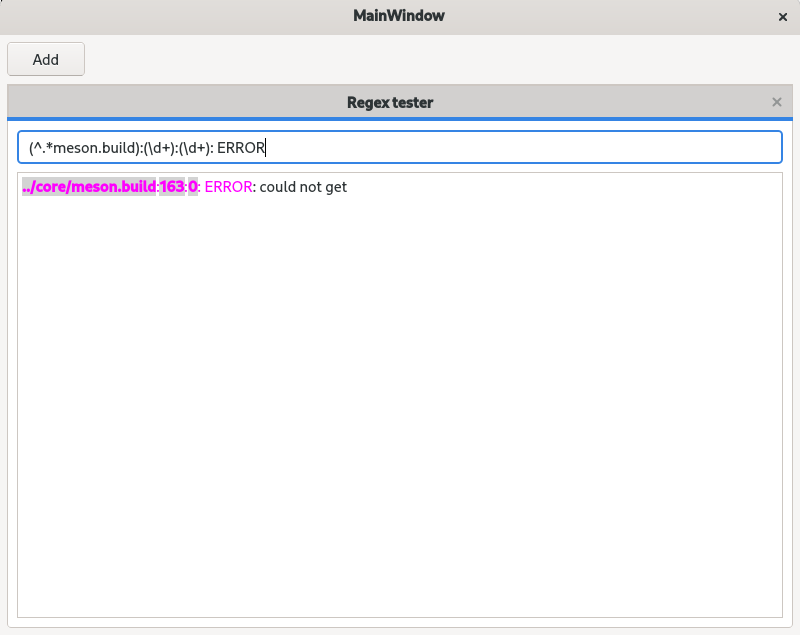
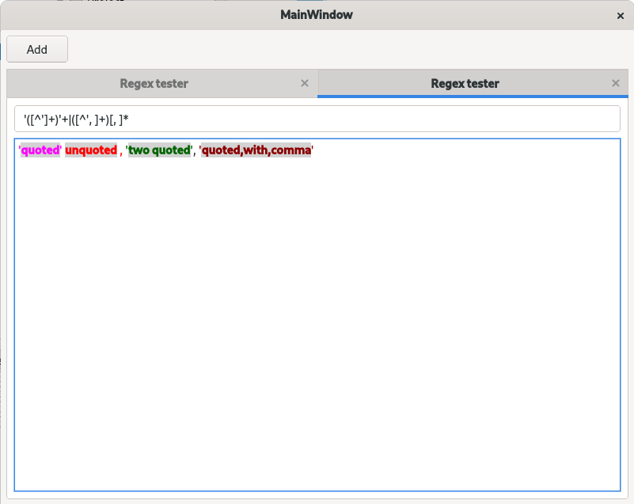

[](https://www.gnu.org/licenses/gpl-3.0)

# QRegularExpressionTester

This is a really basic and dirty implementation of a GUI to test and explore Qt's QRegularExpression. The main goal is to see which part of a given text would be matched by a given regex.

Example 1            |  Example 2
:-------------------------:|:-------------------------:
  |  

As shown on examples it basically colours matches and overline captures.
It is not able yet to link captures to regex groups, maybe later.

# how to build?

This is a toy application, don't expect any packaging or effort from me.
 
```bash
mkdir build
cd build
cmake ..
make 
```